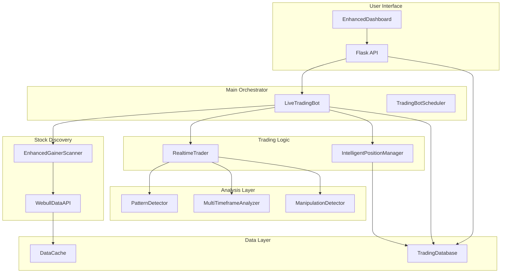
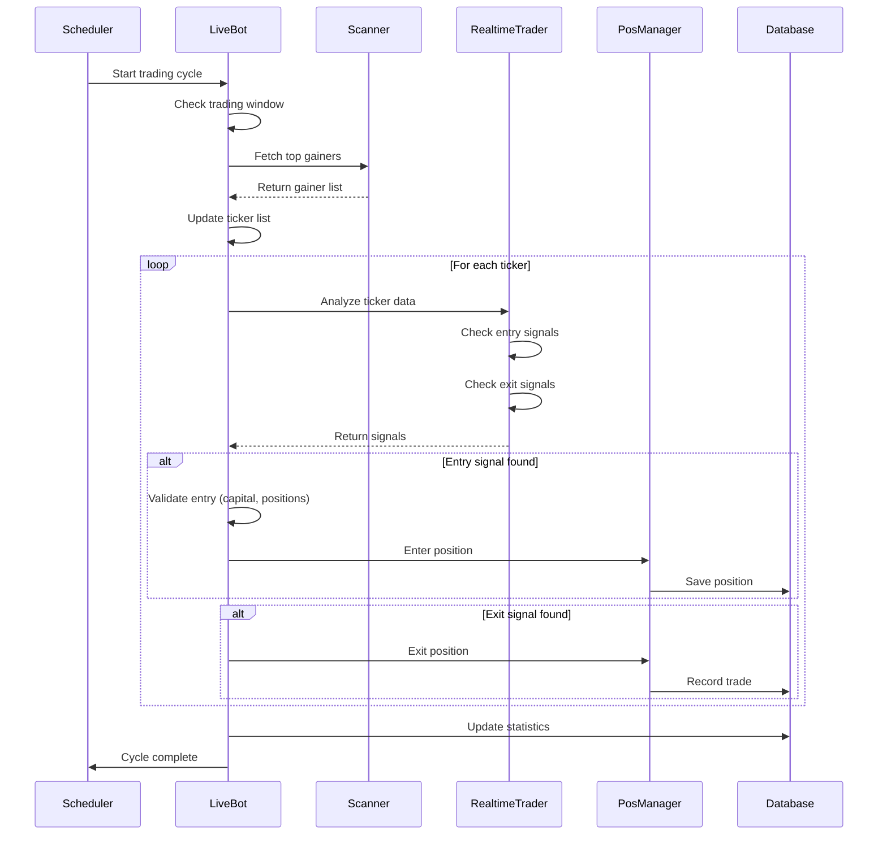
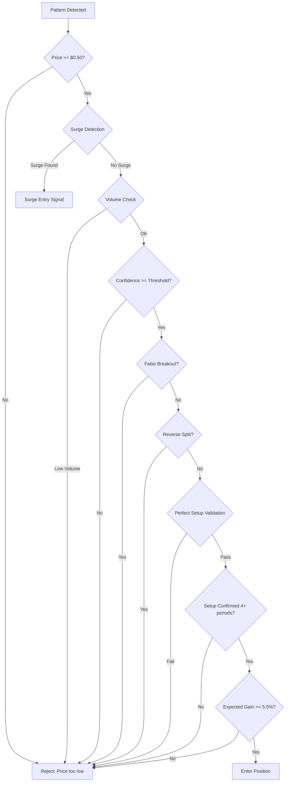
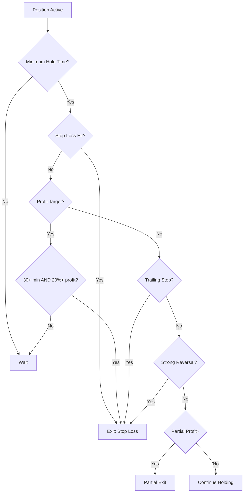
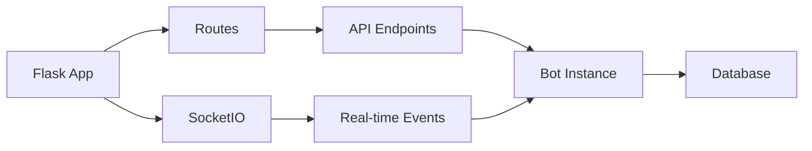

# Complete Trading Bot System Documentation

## Table of Contents

1. [System Architecture](#system-architecture)
2. [Core Trading Flow](#core-trading-flow)
3. [Stock Discovery & Scanning](#stock-discovery--scanning)
4. [Pattern Detection System](#pattern-detection-system)
5. [Entry Logic](#entry-logic)
6. [Position Management](#position-management)
7. [Exit Logic](#exit-logic)
8. [Risk Management](#risk-management)
9. [Database Persistence](#database-persistence)
10. [Web Dashboard](#web-dashboard)
11. [Configuration System](#configuration-system)
12. [Data API Integration](#data-api-integration)

---

## System Architecture

### Overview

The trading bot system is a modular, autonomous trading platform designed to identify bullish stock patterns, execute trades, and manage positions with sophisticated entry/exit logic. The system operates in real-time, processing 1-minute market data and making trading decisions based on technical analysis and pattern recognition.

### Component Architecture



### Key Components

#### 1. LiveTradingBot (`src/core/live_trading_bot.py`)

The main orchestrator that coordinates all trading activities.

**Key Responsibilities:**
- Manages the main trading loop
- Coordinates stock discovery and monitoring
- Handles position lifecycle
- Manages capital and risk limits
- Integrates with database for persistence

**Key Methods:**
- `run_single_cycle()`: Executes one complete trading cycle
- `_process_ticker()`: Processes a single ticker for entry/exit signals
- `_execute_entry()`: Executes entry trades with safety checks
- `_execute_exit()`: Executes exit trades and records results

**Configuration:**
```python
initial_capital: float = 10000.0
target_capital: float = 100000.0
min_confidence: float = 0.72
position_size_pct: float = 0.50
max_positions: int = 3
max_trades_per_day: int = 1000
trading_start_time: str = "04:00"
trading_end_time: str = "20:00"
```

#### 2. RealtimeTrader (`src/core/realtime_trader.py`)

Generates entry and exit signals based on real-time market data analysis.

**Key Responsibilities:**
- Analyzes 1-minute data for patterns
- Detects entry opportunities
- Monitors active positions for exit conditions
- Implements surge detection
- Validates entry signals

**Key Methods:**
- `analyze_data()`: Main analysis method returning entry/exit signals
- `_check_entry_signal()`: Validates entry opportunities
- `_check_exit_signals()`: Checks exit conditions for active positions
- `_detect_price_volume_surge()`: Detects explosive price/volume moves

#### 3. IntelligentPositionManager (`src/core/intelligent_position_manager.py`)

Manages positions with intelligent entry/exit logic and partial profit taking.

**Key Responsibilities:**
- Evaluates entry signals
- Manages position lifecycle
- Implements partial profit taking
- Tracks position performance
- Handles different position types

**Position Types:**
- `SCALP`: Quick trades, 1-5% targets
- `SWING`: Medium-term trades, 5-15% targets
- `SURGE`: High momentum, 10-25% targets
- `BREAKOUT`: Breakout trades, 8-15% targets
- `SLOW_MOVER`: Gradual movers, 3-8% targets

#### 4. PatternDetector (`src/analysis/pattern_detector.py`)

Detects bullish and bearish patterns in stock data.

**Key Responsibilities:**
- Calculates technical indicators
- Identifies pattern formations
- Scores pattern confidence
- Filters false breakouts and reverse splits

**Supported Patterns:**
- Volume_Breakout_Momentum
- RSI_Accumulation_Entry
- Golden_Cross_Volume
- Slow_Accumulation
- MACD_Acceleration_Breakout
- Consolidation_Breakout

#### 5. EnhancedGainerScanner (`src/scanning/enhanced_gainer_scanner.py`)

Discovers and filters top gainers from the market.

**Key Responsibilities:**
- Fetches top gainers from Webull API
- Calculates change percentages by market session
- Filters for quality and manipulation
- Tracks historical gainer data

**Market Sessions:**
- `preMarket`: 4:00 AM - 9:30 AM ET
- `1d`: 9:30 AM - 4:00 PM ET (regular hours)
- `afterMarket`: 4:00 PM - 8:00 PM ET

#### 6. TradingDatabase (`src/database/trading_database.py`)

Handles all data persistence using SQLite.

**Key Responsibilities:**
- Stores completed trades
- Tracks active positions
- Records rejected entries
- Calculates statistics
- Manages position restoration

**Database Schema:**
- `trades`: Completed trades with entry/exit details
- `positions`: Active positions
- `rejected_entries`: Rejected entry signals

#### 7. EnhancedDashboard (`src/web/enhanced_dashboard.py`)

Web-based monitoring and control interface.

**Key Responsibilities:**
- Displays real-time bot status
- Shows active positions and P&L
- Displays completed trades
- Provides control buttons (start/stop)
- Shows rejected entries
- Displays top gainers being monitored

---

## Core Trading Flow

### Main Trading Loop

The bot operates in cycles, processing each ticker once per cycle. The cycle timing is synchronized to run at the 5th second of every minute.



### Trading Cycle Execution

The main trading cycle is executed in `run_single_cycle()` method:

```692:746:src/core/live_trading_bot.py
    def _process_ticker(self, ticker: str) -> Tuple[Optional[TradeSignal], List[TradeSignal]]:
        """
        Process a single ticker: check for entry/exit signals
        
        Returns:
            Tuple of (entry_signal, exit_signals)
        """
        # Initialize variables to avoid scope errors
```

**Cycle Steps:**

1. **Stock Discovery** (every 1 minute)
   - Fetch top gainers from Webull API
   - Update ticker monitoring list
   - Sort by change percentage

2. **Data Fetching** (per ticker)
   - Get cached or fetch new 1-minute data
   - Incremental updates for existing tickers
   - Full refresh every 30 minutes

3. **Entry Analysis** (per ticker)
   - Pattern detection
   - Multi-timeframe validation
   - Entry signal validation
   - Fast/slow mover detection

4. **Exit Analysis** (per active position)
   - Check stop loss
   - Check trailing stops
   - Check profit targets
   - Check reversal signals

5. **Trade Execution**
   - Entry: Validate capital, position limits
   - Exit: Execute exit, record trade, update capital

6. **Database Updates**
   - Save positions
   - Record trades
   - Update statistics

### Timing and Synchronization

The bot uses a scheduler that runs checks at the 5th second of every minute:

```103:141:src/core/trading_bot_scheduler.py
    def _scheduler_loop(self):
        """Main scheduler loop"""
        logger.info("Scheduler loop started")
        
        while self.scheduler_running and not self.stop_event.is_set():
            try:
                current_time = datetime.now(self.et_timezone)
                self.last_check_time = current_time
                
                should_run = self._should_bot_be_running(current_time)
                
                # Log current status
                is_weekday = self._is_weekday(current_time)
                is_in_window = self._is_within_trading_window(current_time)
                
                logger.debug(f"Scheduler check - Time: {current_time.strftime('%Y-%m-%d %H:%M:%S ET')} | "
                           f"Weekday: {is_weekday} | In Window: {is_in_window} | Should Run: {should_run}")
                
                # Handle bot start/stop
                if should_run and not self.bot.running:
                    logger.info(f"Starting trading bot at {current_time.strftime('%H:%M:%S ET')} - "
                               f"Weekday: {is_weekday}, In trading window: {is_in_window}")
                    self.bot.start()
                    self.bot_auto_started = True
                    
                elif not should_run and self.bot.running:
                    logger.info(f"Stopping trading bot at {current_time.strftime('%H:%M:%S ET')} - "
                               f"Weekday: {is_weekday}, In trading window: {is_in_window}")
                    self.bot.stop()
                    self.bot_auto_started = False
                
                # Check for state transitions and log them
                if self.bot_auto_started and not should_run:
                    logger.info("Trading window ended - Bot entering sleep mode")
                elif not self.bot_auto_started and should_run and not self.bot.running:
                    logger.info("Trading window started - Bot waking up")
                
                # Sleep for 30 seconds before next check
                if
```

**Trading Window:**
- Start: 4:00 AM ET
- End: 8:00 PM ET
- Sleep: 8:00 PM - 4:00 AM ET

---

## Stock Discovery & Scanning

### Top Gainers Scanner

The scanner fetches top gainers from Webull API and processes them for monitoring.

**Implementation:** `src/scanning/enhanced_gainer_scanner.py`

```66:142:src/scanning/enhanced_gainer_scanner.py
    def fetch_and_analyze_gainers(self, page_size: int = 30) -> List[GainerData]:
        """
        Fetch top gainers and return them directly without filtering
        
        Args:
            page_size: Number of gainers to fetch
            
        Returns:
            List of gainer data (no filtering applied)
        """
        try:
            rank_type = self.get_current_rank_type()
            raw_gainers = fetch_top_gainers(rankType=rank_type, pageSize=page_size)
            
            if not raw_gainers:
                logger.warning(f"No gainers returned for rank type: {rank_type}")
                return []
            
            # Extract the actual data from the response
            gainers_list = raw_gainers
            if isinstance(raw_gainers, dict) and 'data' in raw_gainers:
                gainers_list = raw_gainers['data']
            elif not isinstance(raw_gainers, list):
                logger.error(f"Unexpected response format: {type(raw_gainers)}")
                return []
            
            if not gainers_list:
                logger.warning(f"No gainers data found in response for rank type: {rank_type}")
                return []
            
            logger.info(f"=== RAW TOP GAINERS ({len(gainers_list)} total) ===")
            simple_gainers = []
            for i, gainer in enumerate(gainers_list):
                if isinstance(gainer, dict):
                    # Get symbol with multiple possible field names
                    symbol = (gainer.get('symbol') or 
                             gainer.get('ticker') or 
                             gainer.get('code') or 
                             gainer.get('disSymbol') or f'TICKER_{i+1}')
                    
                    # Get price with multiple possible field names
                    price = (gainer.get('price') or 
                             gainer.get('currentPrice') or 
                             gainer.get('last') or 
                             gainer.get('close') or 0)
                    
                    # Calculate change percentage
                    change_pct = self._calculate_change_pct(gainer, rank_type)
                    
                    logger.info(f"  {i+1}. {symbol}: {price} ({change_pct:.2f}%)")
                    
                    # Create simple GainerData object
                    simple_gainer = GainerData(
                        symbol=symbol,
                        price=float(price) if price else 0,
                        change_pct=change_pct,
                        volume=int(gainer.get('volume', 0)),
                        avg_volume=int(gainer.get('avgVol10D', 0)),
                        volume_ratio=1.0,
                        market_cap=float(gainer.get('marketValue', 0)),
                        sector=gainer.get('sector', ''),
                        rank_type=rank_type,
                        surge_score=0.5,
                        manipulation_score=0.3,
                        quality_score=0.7
                    )
                    simple_gainers.append(simple_gainer)
                else:
                    logger.info(f"  {i+1}. Non-dict data: {gainer}")
            
            logger.info("=== END GAINER LIST ===")
            return simple_gainers
            
        except Exception as e:
            logger.error(f"Error fetching gainers: {e}")
            return []
```

### Change Percentage Calculation

The scanner calculates change percentage differently based on market session:

```143:196:src/scanning/enhanced_gainer_scanner.py
    def _calculate_change_pct(self, gainer: Dict, rank_type: str) -> float:
        """
        Calculate percentage change based on market session
        
        Args:
            gainer: Raw gainer data
            rank_type: Current market session ('preMarket', '1d', 'afterMarket')
            
        Returns:
            Percentage change
        """
        try:
            # Try multiple possible field names for current price
            current_price = float((gainer.get('price') or 
                                 gainer.get('currentPrice') or 
                                 gainer.get('last') or 
                                 gainer.get('close') or 0))
            
            if current_price == 0:
                return 0.0
            
            if rank_type == 'preMarket':
                # Pre-market: Change from previous close
                prev_close = float((gainer.get('preClose') or 
                                  gainer.get('previousClose') or 
                                  gainer.get('prevClose') or 0))
                if prev_close == 0:
                    return 0.0
                change_pct = ((current_price - prev_close) / prev_close) * 100
                
            elif rank_type == 'afterMarket':
                # After-hours: Change from regular close
                # Use 'close' field for regular session close
                regular_close = float((gainer.get('close') or 
                                     gainer.get('regularClose') or 
                                     gainer.get('dayClose') or 0))
                if regular_close == 0:
                    return 0.0
                change_pct = ((current_price - regular_close) / regular_close) * 100
                
            else:  # '1d' - regular hours
                # Regular hours: Change from previous close
                prev_close = float((gainer.get('preClose') or 
                                  gainer.get('previousClose') or 
                                  gainer.get('prevClose') or 0))
                if prev_close == 0:
                    return 0.0
                change_pct = ((current_price - prev_close) / prev_close) * 100
            
            return change_pct
            
        except Exception as e:
            logger.warning(f"Error calculating change pct: {e}")
            return 0.0
```

**Calculation Rules:**
- **Premarket**: `(current_price - previous_close) / previous_close * 100`
- **Regular Hours**: `(current_price - previous_close) / previous_close * 100`
- **After-Hours**: `(current_price - regular_close) / regular_close * 100`

### Ticker List Management

The bot maintains a dynamic list of tickers to monitor, updated from top gainers:

```437:485:src/core/live_trading_bot.py
    def update_tickers_from_gainers(self, max_tickers: int = 30):
        """
        Update ticker list from top gainers (if using WebullDataAPI)
        
        Args:
            max_tickers: Maximum number of tickers to fetch
        """
        if hasattr(self.data_api, 'get_stock_list_from_gainers'):
            try:
                # Get full gainer data (not just symbols) to access change percentage
                gainer_data = self.data_api.get_top_gainers(page_size=max_tickers)
                # Sort by change percentage (descending - highest first)
                gainer_data_sorted = sorted(
                    gainer_data, 
                    key=lambda x: x.get('change_ratio', 0) or x.get('changeRatio', 0) or 0, 
                    reverse=True
                )
                # Update top gainers list
                new_tickers = [g.get('symbol', '') for g in gainer_data_sorted if g.get('symbol')]
                self.top_gainers = new_tickers[:max_tickers]
                # Store full gainer data with change % for API endpoint
                self.top_gainers_data = gainer_data_sorted[:max_tickers]
                
                # Add new tickers that aren't already being monitored
                # First, validate tickers by checking if we can get their ticker ID
                valid_tickers = []
                for ticker in new_tickers:
                    if not ticker or not ticker.strip():
                        continue
                    # Try to validate ticker by checking if we can get ticker ID
                    try:
                        ticker_id = self.data_api._get_ticker_id(ticker)
                        if ticker_id:
                            valid_tickers.append(ticker)
                        else:
                            logger.warning(f"Skipping invalid ticker {ticker} (ticker ID not found)")
                    except Exception as e:
                        logger.warning(f"Skipping invalid ticker {ticker}: {e}")
                
                # Add only valid tickers
                added = 0
                for ticker in valid_tickers:
                    if ticker not in self.tickers:
                        self.add_ticker(ticker)
                        added += 1
                if added > 0:
                    logger.info(f"Updated ticker list: Added {added} new tickers from top gainers")
            except Exception as e:
                logger.error(f"Error updating tickers from gainers: {e}")
```

**Update Frequency:** Every 1 minute during trading window

---

## Pattern Detection System

### Technical Indicators

The pattern detector calculates a comprehensive set of technical indicators:

```44:154:src/analysis/pattern_detector.py
    def calculate_indicators(self, df: pd.DataFrame) -> pd.DataFrame:
        """Calculate technical indicators"""
        df = df.copy()
        
        # Moving Averages
        df['sma_5'] = df['close'].rolling(window=5).mean()
        df['sma_10'] = df['close'].rolling(window=10).mean()
        df['sma_20'] = df['close'].rolling(window=20).mean()
        df['ema_12'] = df['close'].ewm(span=12, adjust=False).mean()
        df['ema_26'] = df['close'].ewm(span=26, adjust=False).mean()
        
        # RSI (Relative Strength Index)
        delta = df['close'].diff()
        gain = (delta.where(delta > 0, 0)).rolling(window=14).mean()
        loss = (-delta.where(delta < 0, 0)).rolling(window=14).mean()
        rs = gain / loss
        df['rsi'] = 100 - (100 / (1 + rs))
        
        # MACD
        df['macd'] = df['ema_12'] - df['ema_26']
        df['macd_signal'] = df['macd'].ewm(span=9, adjust=False).mean()
        df['macd_hist'] = df['macd'] - df['macd_signal']
        
        # Bollinger Bands
        df['bb_middle'] = df['close'].rolling(window=20).mean()
        bb_std = df['close'].rolling(window=20).std()
        df['bb_upper'] = df['bb_middle'] + (bb_std * 2)
        df['bb_lower'] = df['bb_middle'] - (bb_std * 2)
        df['bb_width'] = (df['bb_upper'] - df['bb_lower']) / df['bb_middle']
        df['bb_position'] = (df['close'] - df['bb_lower']) / (df['bb_upper'] - df['bb_lower'])
        
        # Volume indicators
        df['volume_sma'] = df['volume'].rolling(window=20).mean()
        df['volume_ratio'] = df['volume'] / df['volume_sma']
        
        # VWAP (Volume Weighted Average Price) - calculate if not present
        if 'vwap' not in df.columns:
            # Calculate VWAP: cumulative (price * volume) / cumulative volume
            typical_price = (df['high'] + df['low'] + df['close']) / 3
            df['vwap'] = (typical_price * df['volume']).cumsum() / df['volume'].cumsum()
        
        # Price change indicators
        df['price_change'] = df['close'].pct_change()
        df['price_change_5'] = df['close'].pct_change(periods=5)
        df['price_change_10'] = df['close'].pct_change(periods=10)
        
        # Volatility
        df['atr'] = self._calculate_atr(df, period=14)
        df['volatility'] = df['close'].rolling(window=20).std() / df['close'].rolling(window=20).mean()
        
        # Support/Resistance levels
        df['recent_high'] = df['high'].rolling(window=20).max()
        df['recent_low'] = df['low'].rolling(window=20).min()
        
        # Momentum
        df['momentum'] = df['close'] - df['close'].shift(10)
        df['momentum_pct'] = df['momentum'] / df['close'].shift(10)
        
        # Advanced momentum indicators (for pattern detection)
        df['momentum_5'] = df['close'].pct_change(5) * 100
        df['momentum_10'] = df['close'].pct_change(10) * 100
        df['momentum_20'] = df['close'].pct_change(20) * 100
        df['momentum_30'] = df['close'].pct_change(30) * 100
        
        # Volume indicators
        df['volume_ma_10'] = df['volume'].rolling(10).mean()
        df['volume_ma_20'] = df['volume'].rolling(20).mean()
        df['volume_trend_5'] = df['volume'] / df['volume'].rolling(5).mean()
        df['volume_trend_10'] = df['volume'] / df['volume_ma_10']
        df['volume_increasing'] = df['volume'] > df['volume'].shift(1)
        
        # Price position in range
        df['high_10'] = df['high'].rolling(10).max()
        df['low_10'] = df['low'].rolling(10).min()
        df['high_20'] = df['high'].rolling(20).max()
        df['low_20'] = df['low'].rolling(20).min()
        df['price_position_10'] = (df['close'] - df['low_10']) / (df['high_10'] - df['low_10'] + 0.0001) * 100
        df['price_position_20'] = (df['close'] - df['low_20']) / (df['high_20'] - df['low_20'] + 0.0001) * 100
        
        # Moving average relationships
        df['sma5_above_sma10'] = df['sma_5'] > df['sma_10']
        df['sma10_above_sma20'] = df['sma_10'] > df['sma_20']
        df['ma_bullish_order'] = df['sma5_above_sma10'] & df['sma10_above_sma20']
        df['price_above_all_ma'] = (df['close'] > df['sma_5']) & (df['close'] > df['sma_10']) & (df['close'] > df['sma_20'])
        
        # MACD indicators
        df['macd_bullish'] = df['macd'] > df['macd_signal']
        df['macd_hist_positive'] = df['macd_hist'] > 0
        df['macd_hist_increasing'] = df['macd_hist'] > df['macd_hist'].shift(1)
        df['macd_hist_accelerating'] = (df['macd_hist'] > df['macd_hist'].shift(1)) & (df['macd_hist'].shift(1) > df['macd_hist'].shift(2))
        
        # Higher highs/lower lows
        df['higher_high_10'] = df['high'] > df['high'].shift(1)
        df['higher_high_20'] = df['high'] > df['high'].rolling(10).max().shift(10)
        df['higher_low_10'] = df['low'] > df['low'].shift(1)
        
        # Breakout indicators
        df['breakout_10'] = df['close'] > df['high_10'].shift(1) * 1.02  # 2% above 10-period high
        df['breakout_20'] = df['close'] > df['high_20'].shift(1) * 1.02  # 2% above 20-period high
        
        # Consolidation detection
        df['range_10'] = (df['high_10'] - df['low_10']) / df['low_10'] * 100
        df['in_consolidation'] = df['range_10'] < 3.0  # Less than 3% range
        
        # RSI zones
        df['rsi_oversold'] = df['rsi'] < 30
        df['rsi_neutral'] = (df['rsi'] >= 30) & (df['rsi'] <= 70)
        df['rsi_accumulation'] = (df['rsi'] >= 50) & (df['rsi'] <= 65)
        df['rsi_overbought'] = df['rsi'] > 70
        
        return df
```

### Pattern Detection

The system detects six primary bullish patterns:

#### 1. Volume_Breakout_Momentum
**Confidence:** 0.85  
**Criteria:**
- `volume_ratio >= 1.8`
- `momentum_10 >= 2.0%`
- `breakout_10 == True`
- `price_above_all_ma == True`

#### 2. RSI_Accumulation_Entry
**Confidence:** 0.75  
**Criteria:**
- `rsi_accumulation == True` (RSI 50-65)
- `momentum_10 >= 2.0%`
- `volume_ratio >= 1.8`
- `macd_hist_increasing == True`
- `higher_high_20 == True`

#### 3. Golden_Cross_Volume
**Confidence:** 0.78  
**Criteria:**
- `sma5_above_sma10 == True`
- `sma10_above_sma20 == True` (just crossed)
- `volume_ratio >= 1.5`
- `momentum_10 >= 1.5%`

#### 4. Slow_Accumulation
**Confidence:** 0.80  
**Criteria:**
- `1.8 <= volume_ratio < 3.5`
- `momentum_10 >= 2.0%`
- `momentum_20 >= 3.0%`
- `volume_trend_10 >= 1.3`
- `macd_hist_accelerating == True`
- `price_position_20 >= 70`

#### 5. MACD_Acceleration_Breakout
**Confidence:** 0.82  
**Criteria:**
- `macd_hist_accelerating == True`
- `macd_bullish == True`
- `breakout_20 == True`
- `volume_ratio >= 2.0`
- `momentum_20 >= 3.0%`

#### 6. Consolidation_Breakout
**Confidence:** 0.83  
**Criteria:**
- `in_consolidation == False` (just broke out)
- Was consolidating in last 5 bars (3+ periods)
- `breakout_10 == True`
- `volume_ratio >= 2.0`
- `price_above_all_ma == True`

**Pattern Detection Implementation:**

```455:611:src/analysis/pattern_detector.py
    def _detect_bullish_patterns(self, df: pd.DataFrame, idx: int, current: pd.Series, 
                                 ticker: str, date: str) -> List[PatternSignal]:
        """Detect bullish patterns based on user rules"""
        signals = []
        
        # Need at least 30 bars of data for pattern detection
        if idx < 30:
            return signals
        
        current_price = current['close']
        
        # Pattern 1: Volume_Breakout_Momentum (Score: 8, Confidence: 0.85)
        # Criteria: volume_ratio >= 1.8, momentum_10 >= 2.0%, breakout_10 == True, price_above_all_ma == True
        if (current.get('volume_ratio', 0) >= 1.8 and
            current.get('momentum_10', 0) >= 2.0 and
            current.get('breakout_10', False) and
            current.get('price_above_all_ma', False)):
            confidence = 0.85
            target = current_price * 1.20  # 20% target
            stop = current_price * 0.85   # 15% stop
            signals.append(PatternSignal(
                ticker=ticker, date=date, pattern_type='bullish',
                pattern_name='Volume_Breakout_Momentum', confidence=confidence,
                entry_price=current_price, target_price=target, stop_loss=stop,
                timestamp=current['timestamp'],
                indicators={
                    'volume_ratio': current.get('volume_ratio', 0),
                    'momentum_10': current.get('momentum_10', 0),
                    'breakout_10': current.get('breakout_10', False)
                }
            ))
        
        # Pattern 2: RSI_Accumulation_Entry (Score: 7, Confidence: 0.75)
        # Criteria: rsi_accumulation == True, momentum_10 >= 2.0%, volume_ratio >= 1.8,
        #          macd_hist_increasing == True, higher_high_20 == True
        if (current.get('rsi_accumulation', False) and
            current.get('momentum_10', 0) >= 2.0 and
            current.get('volume_ratio', 0) >= 1.8 and
            current.get('macd_hist_increasing', False) and
            current.get('higher_high_20', False)):
            confidence = 0.75
            target = current_price * 1.20  # 20% target
            stop = current_price * 0.85    # 15% stop
            signals.append(PatternSignal(
                ticker=ticker, date=date, pattern_type='bullish',
                pattern_name='RSI_Accumulation_Entry', confidence=confidence,
                entry_price=current_price, target_price=target, stop_loss=stop,
                timestamp=current['timestamp'],
                indicators={
                    'rsi': current.get('rsi', 0),
                    'momentum_10': current.get('momentum_10', 0),
                    'volume_ratio': current.get('volume_ratio', 0)
                }
            ))
        
        # Pattern 3: Golden_Cross_Volume (Score: 7, Confidence: 0.78)
        # Criteria: sma5_above_sma10 == True, sma10_above_sma20 == True,
        #          JUST crossed (sma10_above_sma20 was False, now True),
        #          volume_ratio >= 1.5, momentum_10 >= 1.5%
        if idx > 0 and len(df) > idx:
            prev = df.iloc[idx - 1]
            prev_sma10_above_sma20 = prev.get('sma10_above_sma20', False) if 'sma10_above_sma20' in prev else False
            if (current.get('sma5_above_sma10', False) and
                current.get('sma10_above_sma20', False) and
                not prev_sma10_above_sma20 and  # Just crossed
                current.get('volume_ratio', 0) >= 1.5 and
                current.get('momentum_10', 0) >= 1.5):
                confidence = 0.78
                target = current_price * 1.20  # 20% target
                stop = current_price * 0.85   # 15% stop
                signals.append(PatternSignal(
                    ticker=ticker, date=date, pattern_type='bullish',
                    pattern_name='Golden_Cross_Volume', confidence=confidence,
                    entry_price=current_price, target_price=target, stop_loss=stop,
                    timestamp=current['timestamp'],
                    indicators={
                        'sma5_above_sma10': current.get('sma5_above_sma10', False),
                        'sma10_above_sma20': current.get('sma10_above_sma20', False),
                        'volume_ratio': current.get('volume_ratio', 0)
                    }
                ))
        
        # Pattern 4: Slow_Accumulation (Score: 7, Confidence: 0.80)
        # Criteria: 1.8 <= volume_ratio < 3.5, momentum_10 >= 2.0%, momentum_20 >= 3.0%,
        #          volume_trend_10 >= 1.3, macd_hist_accelerating == True, price_position_20 >= 70
        volume_ratio = current.get('volume_ratio', 0)
        if (1.8 <= volume_ratio < 3.5 and
            current.get('momentum_10', 0) >= 2.0 and
            current.get('momentum_20', 0) >= 3.0 and
            current.get('volume_trend_10', 0) >= 1.3 and
            current.get('macd_hist_accelerating', False) and
            current.get('price_position_20', 0) >= 70):
            confidence = 0.80
            target = current_price * 1.20  # 20% target
            stop = current_price * 0.85   # 15% stop
            signals.append(PatternSignal(
                ticker=ticker, date=date, pattern_type='bullish',
                pattern_name='Slow_Accumulation', confidence=confidence,
                entry_price=current_price, target_price=target, stop_loss=stop,
                timestamp=current['timestamp'],
                indicators={
                    'volume_ratio': volume_ratio,
                    'momentum_10': current.get('momentum_10', 0),
                    'momentum_20': current.get('momentum_20', 0)
                }
            ))
        
        # Pattern 5: MACD_Acceleration_Breakout (Score: 8, Confidence: 0.82)
        # Criteria: macd_hist_accelerating == True, macd_bullish == True,
        #          breakout_20 == True, volume_ratio >= 2.0, momentum_20 >= 3.0%
        if (current.get('macd_hist_accelerating', False) and
            current.get('macd_bullish', False) and
            current.get('breakout_20', False) and
            current.get('volume_ratio', 0) >= 2.0 and
            current.get('momentum_20', 0) >= 3.0):
            confidence = 0.82
            target = current_price * 1.20  # 20% target
            stop = current_price * 0.85   # 15% stop
            signals.append(PatternSignal(
                ticker=ticker, date=date, pattern_type='bullish',
                pattern_name='MACD_Acceleration_Breakout', confidence=confidence,
                entry_price=current_price, target_price=target, stop_loss=stop,
                timestamp=current['timestamp'],
                indicators={
                    'macd_hist_accelerating': current.get('macd_hist_accelerating', False),
                    'macd_bullish': current.get('macd_bullish', False),
                    'breakout_20': current.get('breakout_20', False)
                }
            ))
        
        # Pattern 6: Consolidation_Breakout (Score: 8, Confidence: 0.83)
        # Criteria: in_consolidation == False (just broke out),
        #          was consolidating in last 5 bars (3+ periods),
        #          breakout_10 == True, volume_ratio >= 2.0, price_above_all_ma == True
        if idx >= 5:
            was_consolidating = df.iloc[idx-5:idx]['in_consolidation'].sum() >= 3
            if (not current.get('in_consolidation', False) and  # Just broke out
                was_consolidating and  # Was consolidating
                current.get('breakout_10', False) and
                current.get('volume_ratio', 0) >= 2.0 and
                current.get('price_above_all_ma', False)):
                confidence = 0.83
                target = current_price * 1.20  # 20% target
                stop = current_price * 0.85   # 15% stop
                signals.append(PatternSignal(
                    ticker=ticker, date=date, pattern_type='bullish',
                    pattern_name='Consolidation_Breakout', confidence=confidence,
                    entry_price=current_price, target_price=target, stop_loss=stop,
                    timestamp=current['timestamp'],
                    indicators={
                        'was_consolidating': was_consolidating,
                        'breakout_10': current.get('breakout_10', False),
                        'volume_ratio': current.get('volume_ratio', 0)
                    }
                ))
        
        return signals
```

### False Breakout Detection

The system filters out false breakouts to avoid entering on temporary price spikes:

```308:387:src/analysis/pattern_detector.py
    def _is_false_breakout(self, df: pd.DataFrame, signal_idx: int, signal: PatternSignal,
                          forward_data: pd.DataFrame) -> bool:
        """
        Detect if a breakout signal is a false breakout.
        False breakouts typically show:
        - Price breaks out but then quickly reverses back below breakout level
        - Breakout doesn't sustain for multiple periods
        - Volume may spike initially but then drop
        """
        try:
            # Only check bullish patterns for false breakouts
            if signal.pattern_type != 'bullish':
                return False
            
            if len(forward_data) < 3:
                return False
            
            entry_price = signal.entry_price
            
            # For breakout patterns, check if price sustains above entry
            breakout_patterns = ['Volume_Breakout', 'Consolidation_Breakout', 'BB_Lower_Bounce']
            
            if signal.pattern_name in breakout_patterns:
                # Check if price breaks above entry but then falls back below
                prices = forward_data['close'].values
                highs = forward_data['high'].values
                
                # Check if price went above entry (breakout occurred)
                broke_above = any(h > entry_price * 1.01 for h in highs)  # At least 1% above
                
                if broke_above:
                    # Check if price fell back below entry level
                    # Count how many periods price stayed above entry
                    periods_above = sum(1 for p in prices if p > entry_price)
                    total_periods = len(prices)
                    
                    # If price was above entry less than 30% of the time, it's a false breakout
                    if periods_above / total_periods < 0.3:
                        # Additional check: if final price is significantly below entry
                        final_price = prices[-1]
                        if final_price < entry_price * 0.98:  # 2% below entry
                            return True
                    
                    # Check for quick reversal pattern
                    # Price goes up, then quickly reverses
                    if len(prices) >= 3:
                        # Find the peak
                        peak_idx = prices.argmax()
                        peak_price = prices[peak_idx]
                        
                        # If peak is early and price drops significantly
                        if peak_idx < len(prices) // 2:
                            final_price = prices[-1]
                            drop_from_peak = ((peak_price - final_price) / peak_price) * 100
                            
                            # If dropped >15% from peak and ended below entry, false breakout
                            if drop_from_peak > 15 and final_price < entry_price:
                                return True
            
            # For other patterns, check if price doesn't sustain the move
            # If price increases but then reverses significantly
            if signal.max_price_reached:
                max_price = signal.max_price_reached
                final_price = forward_data.iloc[-1]['close']
                
                # Calculate how much of the gain was given back
                gain_from_entry = ((max_price - entry_price) / entry_price) * 100
                loss_from_max = ((max_price - final_price) / max_price) * 100
                
                # If significant gain (>20%) but then lost >50% of that gain, likely false signal
                if gain_from_entry > 20 and loss_from_max > 50:
                    # Additional check: if final price is near or below entry
                    if final_price <= entry_price * 1.05:  # Within 5% of entry
                        return True
            
            return False
            
        except Exception as e:
            # If any error occurs, don't filter (be conservative)
            return False
```

### Reverse Split Detection

The system filters out reverse split scenarios:

```165:306:src/analysis/pattern_detector.py
    def _is_reverse_split(self, df: pd.DataFrame, signal_idx: int, signal: PatternSignal, 
                          forward_data: pd.DataFrame) -> bool:
        """
        Detect if a massive price increase is due to a reverse stock split.
        Reverse splits typically show:
        - Massive overnight/next-day price increases (>100%, >200%)
        - Price gap at the start of trading session
        - Price increase not sustained (often reverses quickly)
        - May have normal or lower volume
        """
        try:
            # Check if we have enough data to analyze
            if len(forward_data) < 2:
                return False
            
            # Calculate the price increase percentage
            if signal.max_price_reached:
                max_gain_pct = ((signal.max_price_reached - signal.entry_price) / signal.entry_price) * 100
            elif signal.price_change_after:
                max_gain_pct = signal.price_change_after
            else:
                return False
            
            # Only check for reverse splits if there's a massive price increase (>100%)
            if max_gain_pct < 100:
                return False
            
            # Extremely large price increases (>500%) are suspicious and often reverse splits
            # Normal trading rarely produces such massive moves overnight/next-day
            if max_gain_pct > 500:
                # Check if this is an overnight/next-day gap (common in reverse splits)
                entry_time = pd.to_datetime(signal.timestamp)
                if len(forward_data) > 0:
                    first_period_time = pd.to_datetime(forward_data.iloc[0]['timestamp'])
                    time_diff = (first_period_time - entry_time).total_seconds() / 3600  # hours
                    
                    # If there's a significant time gap (>4 hours, likely overnight)
                    # and massive price increase, likely reverse split
                    if time_diff > 4 and max_gain_pct > 500:
                        # Additional validation: check if the price ratio suggests a reverse split
                        # Reverse splits often have clean ratios like 1:10, 1:20, 1:50, etc.
                        price_ratio = signal.max_price_reached / signal.entry_price
                        
                        # Check if ratio is close to common reverse split ratios
                        common_ratios = [10, 20, 25, 50, 100, 200, 250, 500, 1000]
                        for ratio in common_ratios:
                            if abs(price_ratio - ratio) / ratio < 0.15:  # Within 15% of common ratio
                                return True
                        
                        # Even if not a clean ratio, if gain is >500% with overnight gap,
                        # it's likely a reverse split unless there's extremely high volume
                        first_period = forward_data.iloc[0]
                        avg_volume = df['volume'].rolling(window=20).mean().iloc[signal_idx] if signal_idx >= 20 else df['volume'].mean()
                        first_volume = first_period['volume']
                        
                        # If volume is not extremely high (>10x average), likely reverse split
                        if first_volume < avg_volume * 10:
                            return True
                
                # For gains >1000%, be even more aggressive
                if max_gain_pct > 1000:
                    # Additional validation: check if the price ratio suggests a reverse split
                    price_ratio = signal.max_price_reached / signal.entry_price
                    
                    # Check if ratio is close to common reverse split ratios
                    common_ratios = [10, 20, 25, 50, 100, 200, 250, 500, 1000]
                    for ratio in common_ratios:
                        if abs(price_ratio - ratio) / ratio < 0.1:  # Within 10% of common ratio
                            return True
                    
                    # Even if not a clean ratio, if gain is >1000%, it's likely a reverse split
                    # unless there's very high volume (which would suggest a real breakout)
                    if len(forward_data) > 0:
                        first_period = forward_data.iloc[0]
                        avg_volume = df['volume'].rolling(window=20).mean().iloc[signal_idx] if signal_idx >= 20 else df['volume'].mean()
                        first_volume = first_period['volume']
                        
                        # If volume is not extremely high (>5x average), likely reverse split
                        if first_volume < avg_volume * 5:
                            return True
            
            # Check for overnight/next-day gap (large price jump between periods)
            # Look at the first few periods after the signal
            if len(forward_data) >= 2:
                entry_price = signal.entry_price
                first_period = forward_data.iloc[0]
                second_period = forward_data.iloc[1] if len(forward_data) > 1 else None
                
                # Check for massive gap in the first period
                first_open = first_period['open']
                first_close = first_period['close']
                gap_pct = ((first_open - entry_price) / entry_price) * 100
                
                # If there's a massive gap (>50%) at the start, likely a reverse split
                if gap_pct > 50:
                    # Additional check: see if price reverses quickly after the gap
                    if len(forward_data) >= 3:
                        # Check if price drops significantly after the initial jump
                        max_price = forward_data['high'].max()
                        final_price = forward_data.iloc[-1]['close']
                        reversal_pct = ((max_price - final_price) / max_price) * 100
                        
                        # If price reverses by >30% after the jump, likely a reverse split
                        if reversal_pct > 30:
                            return True
                    
                    # If gap is >200%, almost certainly a reverse split
                    if gap_pct > 200:
                        return True
                
                # Check for massive single-period price increase (>150%)
                single_period_gain = ((first_close - entry_price) / entry_price) * 100
                if single_period_gain > 150:
                    # Check volume - reverse splits may have normal or lower volume
                    avg_volume = df['volume'].rolling(window=20).mean().iloc[signal_idx] if signal_idx >= 20 else df['volume'].mean()
                    first_volume = first_period['volume']
                    
                    # If massive gain with normal/low volume, likely reverse split
                    if first_volume < avg_volume * 1.5:  # Not a high-volume breakout
                        return True
            
            # Check for price pattern typical of reverse splits
            # Reverse splits often show: massive jump, then quick reversal
            if len(forward_data) >= 5:
                prices = forward_data['close'].values
                max_idx = prices.argmax()
                
                # If max price is early and price drops significantly after
                if max_idx < len(prices) // 2:  # Max price in first half
                    max_price = prices[max_idx]
                    final_price = prices[-1]
                    drop_from_max = ((max_price - final_price) / max_price) * 100
                    
                    # If dropped >40% from max, likely reverse split
                    if drop_from_max > 40 and max_gain_pct > 150:
                        return True
            
            return False
            
        except Exception as e:
            # If any error occurs, don't filter (be conservative)
            return False
```

---

## Entry Logic

### Entry Signal Flow

The entry logic follows a multi-stage validation process:



### Entry Validation Process

The entry validation process in `_check_entry_signal()` performs multiple checks:

**Priority 0: Minimum Price Filter**
- Rejects stocks below $0.50 per share

**Priority 0.25: Surge Detection**
- Detects explosive price/volume moves
- Primary Surge: 100x volume + 30% price OR 200K volume + 20% price
- Continuation Surge: High volume continuation with price increase
- Surge entries bypass normal validation (minimal checks only)

**Priority 0.5: Volume Requirements**
- Normal stocks: 500K minimum over 60 minutes (or 167K over 20 minutes)
- Fast movers: Same as normal
- Slow movers: 200K minimum (alternative path)
- For Volume_Breakout_Momentum and RSI_Accumulation_Entry: 200K absolute threshold

**Priority 1: Confidence Threshold**
- Normal stocks: 72% minimum
- Fast movers (volume >= 2.5x AND momentum >= 3%): 70% minimum
- Slow movers: 80% minimum
- Time-based adjustments:
  - Before 10 AM: 70%
  - After-hours (4-8 PM): 70%
  - Late-day (3-4 PM): 70%

**Priority 2: False Breakout Detection**
- Checks if price breaks out but quickly reverses
- Skipped for:
  - High confidence patterns (75%+)
  - Fast movers with strong volume/momentum
  - Exceptional volume (5x+)

**Priority 3: Reverse Split Detection**
- Filters massive price increases (>100%) with normal/low volume
- Checks for common reverse split ratios (1:10, 1:20, etc.)

**Priority 4: Perfect Setup Validation**
- Price above all moving averages
- MAs in bullish order (SMA5 > SMA10 > SMA20)
- Volume above average (1.5x+)
- MACD bullish (with multi-timeframe fallback)
- Price making higher highs
- No recent price weakness
- Longer-term uptrend (2%+ over 15 periods)
- Consistent higher lows
- Positive momentum
- Price stability (volatility check)

**Priority 5: Setup Confirmation**
- Setup must be confirmed for 4+ out of last 6 periods
- Relaxed for fast movers (2-4 periods)
- Very strong fast movers (6x+ volume): 1 period
- After-hours/late-day: 1-2 periods

**Priority 6: Expected Gain**
- Minimum 5.5% expected gain required

### Fast Mover Detection

Fast movers are detected based on:
- Volume ratio >= 3.0x (lowered from 5.0x)
- 5-minute momentum >= 3.0% (lowered from 5.0%)
- Volume increasing (not declining)

Fast movers receive:
- Lower confidence threshold (70% vs 72%)
- Relaxed MA requirements
- Wider trailing stops
- Higher profit targets (30-100% vs 20%)

### Slow Mover Alternative Path

When original entry logic fails, the system checks for slow mover entries:

**Criteria:**
- Volume ratio: 1.8x - 3.5x (moderate-high)
- Absolute volume: 200K minimum
- Sustained momentum: 10-min >= 2.0%, 20-min >= 3.0%
- MACD accelerating
- Breakouts confirmed
- Higher highs pattern
- RSI 50-65 (accumulation zone)
- Confidence threshold: 80%

**Exit Logic:** Uses separate slow mover exit logic with wider trailing stops (5% fixed)

### Rejection Tracking

All rejected entries are:
- Stored in database with ticker, price, reason, timestamp, date
- Displayed in web dashboard
- Cleared when position successfully entered
- Persist for the day

---

## Exit Logic

### Exit Signal Flow



### Exit Conditions

#### 1. Hard Stop Loss
- **Always Active:** 15% stop loss
- **Surge Entries:** 12% stop loss
- **Slow Movers:** 15% stop loss (same as normal)
- **Fast Movers:** Dynamic ATR-based (8-10% minimum)

#### 2. Minimum Hold Time
- **Normal:** 20 minutes
- **Premarket Entries:** 15 minutes
- **Surge Entries:** 10 minutes
- **Slow Movers:** 10 minutes

#### 3. Dynamic Trailing Stops

Trailing stops adjust based on profit level:

**Normal Stocks:**
- 50%+ profit: 20% trailing stop
- 30%+ profit: 15% trailing stop
- 20%+ profit: 12% trailing stop
- 15%+ profit: 10% trailing stop
- 10%+ profit: 7% trailing stop
- 5%+ profit: 5% trailing stop
- <5% profit: 5% trailing stop

**Fast Movers:**
- 50%+ profit: 30-40% trailing stop (wider)
- 30%+ profit: 20-30% trailing stop
- 20%+ profit: 15-20% trailing stop
- 10%+ profit: 10-12% trailing stop
- 5%+ profit: 8-10% trailing stop
- <5% profit: 6-8% trailing stop

**After Partial Exits:**
- 150%+ profit: No trailing stop (let it run)
- 100%+ profit: 40% trailing stop
- 50%+ profit: 35% trailing stop
- 30%+ profit: 25% trailing stop
- <30% profit: 20% trailing stop

**ATR-Based Stops:**
- Normal: 2x-3x ATR
- Fast movers: 3x-5x ATR
- Very strong fast movers: 5x ATR

#### 4. Profit Targets
- **Normal:** 20% target (only after 30+ minutes AND 20%+ profit)
- **Surge:** 20-25% target
- **Fast Movers:** 30-100% target (based on strength)
- **Very Strong Fast Movers:** Don't exit on target, use trailing stops

#### 5. Partial Profit Taking
- **First Exit:** 50% at +20% profit
- **Second Exit:** 25% at +40% profit
- **Third Exit:** 12.5% at +80% profit
- **Remaining:** 12.5% with enhanced trailing stops

#### 6. Strong Reversal Detection
- **50%+ profit:** 5+ reversal signals required
- **20%+ profit:** 4+ reversal signals required
- **<20% profit:** 3+ reversal signals required
- **Early in trade (<30 min):** 6+ signals required
- **Price recovering:** Skip reversal detection

Reversal signals include:
- Price declining >2%
- Volume declining >30%
- MACD histogram cut in half
- Price below key MAs
- RSI declining 5+ points
- Multiple down periods

#### 7. Slow Mover Exit Logic
- **Minimum hold time:** 10 minutes
- **Trailing stop:** 5% fixed (wider than normal)
- **ATR-based stop:** `max_price - (atr * 2.5)`
- **Ensures:** Trailing stop never goes below entry price

#### 8. Surge Exit Logic
- **Maximum hold time:** 30 minutes
- **Hard stop:** 12% (tighter than normal)
- **Trailing stop:** 10% (tighter than normal)
- **Progressive profit taking:**
  - 50% at +20% profit
  - 25% at +30% profit
  - Remaining at +50% profit
- **Momentum holding:** Continue if volume >1.8x and RSI <80

---

## Position Management

### Position Types

The system categorizes positions into five types:

#### 1. SCALP
- **Characteristics:** Quick trades, high volume breakouts
- **Target:** 1-5% profit
- **Hold Time:** 5-15 minutes
- **Exit:** Tight trailing stops (2-3%)

#### 2. SWING
- **Characteristics:** Medium-term trends
- **Target:** 5-15% profit
- **Hold Time:** 15-60 minutes
- **Exit:** Standard trailing stops (4-7%)

#### 3. SURGE
- **Characteristics:** Explosive price/volume moves
- **Target:** 10-25% profit
- **Hold Time:** 10-30 minutes
- **Exit:** Surge-specific logic (see Exit Logic)

#### 4. BREAKOUT
- **Characteristics:** Consolidation breakouts
- **Target:** 8-15% profit
- **Hold Time:** 8-30 minutes
- **Exit:** Conservative trailing stops (5%)

#### 5. SLOW_MOVER
- **Characteristics:** Gradual accumulation moves
- **Target:** 3-8% profit
- **Hold Time:** 10+ minutes
- **Exit:** Wide trailing stops (5% fixed)

### Position Lifecycle

1. **Entry:** Position created with entry price, shares, stop loss, target
2. **Tracking:** Current price, P&L, max price reached updated every cycle
3. **Partial Exits:** Shares reduced, entry value adjusted, trailing stops enhanced
4. **Exit:** Position closed, trade recorded, capital returned

### Position Updates

Positions are updated every trading cycle:
- Current price from latest 1-minute data
- Unrealized P&L (dollars and percentage)
- Max price reached (for trailing stops)
- Time in position
- Exit condition checks

---

## Risk Management

### Position Sizing
- **Default:** 50% of capital per trade
- **Configurable:** Via `position_size_pct` setting
- **Minimum:** $100 per trade

### Maximum Positions
- **Default:** 3 concurrent positions
- **Configurable:** Via `max_positions` setting
- **Enforcement:** Checks both memory and database positions

### Daily Trade Limits
- **Default:** 1000 trades per day
- **Configurable:** Via `max_trades_per_day` setting
- **Tracking:** Daily trade count reset at start of new day

### Daily Loss Limits
- **Status:** DISABLED (testing mode)
- **Previous:** -$3000 daily loss limit
- **Reason:** Allows capturing opportunities after initial losses

### Consecutive Loss Limits
- **Status:** DISABLED (testing mode)
- **Previous:** Pause after 300 consecutive losses
- **Reason:** Allows all trades for fine-tuning

### Capital Management
- **Initial Capital:** $10,000 (configurable)
- **Target Capital:** $100,000 (configurable)
- **Daily Profit Targets:** $500 - $50,000 (configurable)
- **Portfolio Value:** Cash + Active Positions (calculated from database)

### Volatility Adjustments
- **ATR-Based Stops:** Adjusts stop loss based on stock volatility
- **Fast Movers:** Wider stops for high volatility
- **Normal Stocks:** Standard stops for moderate volatility

---

## Database Persistence

### Database Schema

#### Trades Table
```sql
CREATE TABLE trades (
    id INTEGER PRIMARY KEY AUTOINCREMENT,
    ticker TEXT NOT NULL,
    entry_time TEXT NOT NULL,
    exit_time TEXT NOT NULL,
    entry_price REAL NOT NULL,
    exit_price REAL NOT NULL,
    shares REAL NOT NULL,
    entry_value REAL NOT NULL,
    exit_value REAL NOT NULL,
    pnl_pct REAL NOT NULL,
    pnl_dollars REAL NOT NULL,
    entry_pattern TEXT NOT NULL,
    exit_reason TEXT NOT NULL,
    confidence REAL NOT NULL,
    created_at TEXT DEFAULT CURRENT_TIMESTAMP
)
```

#### Positions Table
```sql
CREATE TABLE positions (
    id INTEGER PRIMARY KEY AUTOINCREMENT,
    ticker TEXT NOT NULL UNIQUE,
    entry_time TEXT NOT NULL,
    entry_price REAL NOT NULL,
    shares REAL NOT NULL,
    entry_value REAL NOT NULL,
    entry_pattern TEXT NOT NULL,
    confidence REAL NOT NULL,
    target_price REAL,
    stop_loss REAL,
    is_active INTEGER DEFAULT 1,
    created_at TEXT DEFAULT CURRENT_TIMESTAMP,
    updated_at TEXT DEFAULT CURRENT_TIMESTAMP
)
```

#### Rejected Entries Table
```sql
CREATE TABLE rejected_entries (
    id INTEGER PRIMARY KEY AUTOINCREMENT,
    ticker TEXT NOT NULL,
    price REAL NOT NULL,
    reason TEXT NOT NULL,
    timestamp TEXT NOT NULL,
    date TEXT NOT NULL,
    created_at TEXT DEFAULT CURRENT_TIMESTAMP
)
```

### Key Operations

**Add Trade:** Records completed trade with all details
**Add Position:** Creates or updates active position
**Close Position:** Marks position as inactive
**Get Active Positions:** Retrieves all active positions
**Get Statistics:** Calculates win rate, total P&L, etc.
**Get Current Capital:** Calculates capital from trades and positions
**Clear Rejected Entries:** Removes rejected entries for a ticker

### Position Restoration

On bot startup:
1. Load active positions from database
2. Restore to memory (`trader.active_positions`)
3. Continue monitoring and updating
4. Ensures positions survive bot restarts

### Database Features
- **WAL Mode:** Write-Ahead Logging for better concurrency
- **Indexes:** On ticker, entry_time, exit_time, is_active, date
- **Timeout:** 30-second timeout for operations
- **Migration:** Automatic schema migration for new columns

---

## Web Dashboard

### Architecture

The dashboard uses Flask and Flask-SocketIO for real-time updates:



### Main Routes

- `/` - Main dashboard page
- `/positions` - Positions management page
- `/trades` - Trade history page
- `/analytics` - Performance analytics
- `/settings` - Configuration settings
- `/backtest` - Backtesting interface

### API Endpoints

**Status & Control:**
- `GET /api/status` - Bot status
- `POST /api/start` - Start bot
- `POST /api/stop` - Stop bot

**Data:**
- `GET /api/positions` - Active positions
- `GET /api/trades` - Trade history
- `GET /api/performance` - Performance metrics
- `GET /api/market` - Market conditions
- `GET /api/tickers` - Monitored tickers
- `GET /api/rejected-entries` - Rejected entries

**Analysis:**
- `GET /api/daily-analysis` - Daily analysis report
- `POST /api/daily-analysis/run` - Run daily analysis

**Charts:**
- `GET /api/chart/equity` - Equity curve data
- `GET /api/chart/performance` - Performance chart data

### Real-time Updates

SocketIO events:
- `connect` - Client connected
- `disconnect` - Client disconnected
- `status_update` - Bot status changed
- `position_update` - Position updated
- `trade_update` - New trade executed
- `alert` - Alert notification

### Auto-Refresh

- **Interval:** 30 seconds
- **Toggle:** Checkbox in top bar
- **Label:** "Auto-refresh (30s)"
- **Implementation:** Simple JavaScript interval

### UI Components

**Top Statistics Bar:**
- Portfolio Value
- Total Return (%)
- Daily Profit ($)
- Active Positions / Max Positions
- Total Trades
- Monitored Tickers

**Collapsible Sections:**
- Rejected Entry Signals
- Active Positions
- Completed Trades
- Trading Statistics
- Monitoring List - Top Gainers

**Position Management:**
- Update button (refresh position data)
- Close button (manual exit)
- Editable target price and stop loss

---

## Configuration System

### Settings Hierarchy

```python
Settings
├── TradingConfig
│   ├── min_confidence: 0.72
│   ├── min_entry_price_increase: 5.5
│   ├── trailing_stop_pct: 3.0
│   ├── profit_target_pct: 8.0
│   ├── max_loss_per_trade_pct: 6.0
│   ├── position_size_pct: 0.50
│   ├── max_positions: 3
│   └── max_trades_per_day: 1000
├── SurgeDetectionConfig
│   ├── enabled: True
│   ├── min_volume: 50000
│   ├── min_volume_ratio: 150.0
│   └── min_price_increase: 30.0
├── CapitalConfig
│   ├── initial_capital: 10000.0
│   ├── target_capital: 100000.0
│   └── daily_profit_target_min: 500.0
├── TradingWindowConfig
│   ├── start_time: "04:00"
│   ├── end_time: "20:00"
│   └── timezone: "US/Eastern"
└── WebConfig
    ├── host: "0.0.0.0"
    ├── port: 5000
    └── debug: False
```

### Environment Variable Overrides

Settings can be overridden via environment variables:

```bash
TRADING_MIN_CONFIDENCE=0.75
TRADING_POSITION_SIZE_PCT=0.33
CAPITAL_INITIAL=20000.0
WEB_PORT=8080
```

### Configuration Loading

1. **Defaults:** Loaded from dataclass defaults
2. **Environment File:** Optional `.env` file support
3. **Environment Variables:** Override defaults
4. **Runtime:** Settings accessible via `Settings` class

---

## Data API Integration

### WebullDataAPI

The system uses Webull API for market data:

**Key Methods:**
- `get_1min_data(ticker, minutes)` - Fetch 1-minute OHLCV data
- `get_current_price(ticker)` - Get current price
- `get_top_gainers(page_size)` - Fetch top gainers list
- `_get_ticker_id(ticker)` - Get internal ticker ID

### Data Caching

**Strategy:**
- **New Tickers:** Fetch 1200 minutes (max available) and cache
- **Existing Tickers:**
  - Cache < 30 min old: Fetch incremental (5 minutes) and append
  - Cache > 30 min old: Refresh full dataset (1200 minutes)

**Cache Management:**
- Full refresh interval: 30 minutes
- Incremental updates: Every cycle
- Cache storage: In-memory dictionary

### Data Validation

- **Ticker ID Validation:** Verify ticker exists before monitoring
- **Data Quality:** Remove duplicates, sort by timestamp
- **Error Handling:** Fallback to cached data on API errors

### Rate Limiting

- **Timeout:** 30 seconds per request
- **Retries:** 3 attempts with exponential backoff
- **Rate Limit Delay:** 0.1 seconds between requests

---

## Conclusion

This documentation covers the complete trading bot system, from architecture to implementation details. The system is designed to be:

- **Autonomous:** Runs continuously with minimal intervention
- **Intelligent:** Sophisticated pattern detection and validation
- **Risk-Aware:** Multiple layers of risk management
- **Persistent:** All data stored in database
- **Observable:** Real-time web dashboard for monitoring
- **Configurable:** Flexible settings via environment variables

For questions or issues, refer to the code references provided throughout this documentation.
